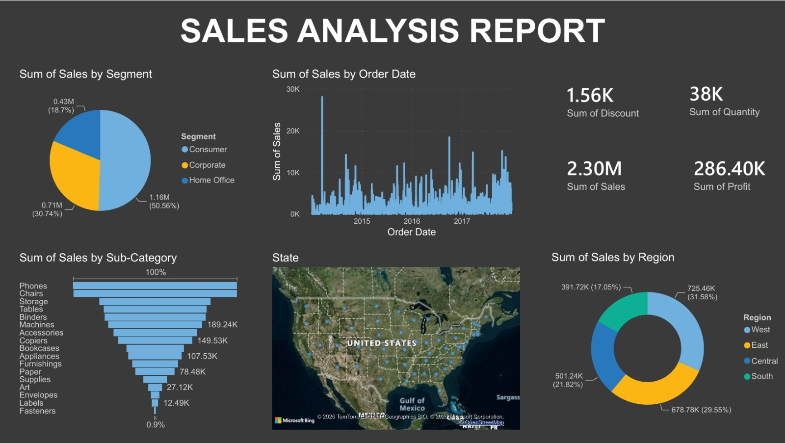

# 📊 Sales Analysis Report (Power BI)

## Overview
This project presents an interactive Sales Analysis Dashboard built using Microsoft Power BI. The dashboard provides insights into sales, profit, discounts, quantity, regional performance, and customer segments using the Sample Superstore dataset.

## Features
- Sales by Segment
- Sales by Region
- Sales by Sub-Category
- Sales Trend Over Time
- Profit Analysis
- Quantity Analysis
- Discount Analysis
- Geographic Sales Distribution

## Tools Used
- Microsoft Power BI
- Power Query
- DAX
- Sample Superstore Dataset

## Files
- Sales Analysis Report.pbix
- Sample - Superstore.xlsx
- dashboard.png

## Dashboard Preview

## Author
Khush Arora
